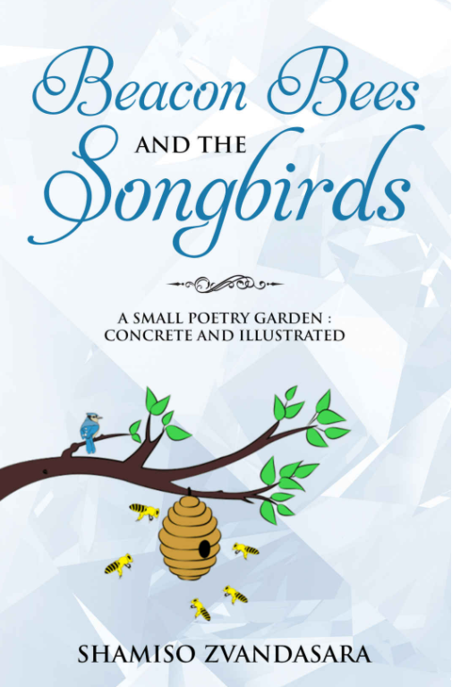
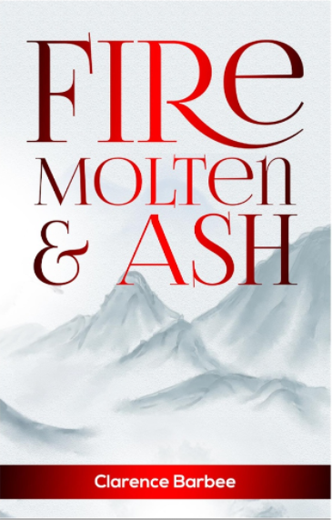

--- 
title: "Words in Different Permutations"
author: "by Michael Yi"
site: bookdown::bookdown_site

 <link rel="shortcut icon" href="faviconp1.png" type="image/x-icon" />
---

# About {.unnumbered #about}
___

#### Greeting, I'm Michael and welcome to my portfolio. I do writing, editing and teaching but I'm always up for more.  {-}

#### Bio {-}

Growing up thinking of STEM as more inherently honourable than arts, I was originally in the Faculty of Science at the University of British Columbia studying Biochemistry before transferring to the English Literature Program. It was not as though my love of English was new, my best memories of high school were participating in Slam Poetry events and attending the seminar of the same novelist every year during career day. If I go even further back, I remember publishing my first fanfiction online when I was 12 years old, less than half a year after I began learning English. 

After using up all of my first year electives on English and Creative Writing classes and spending most of my free time in writing groups, I realised I already knew what I wanted to do with my life; I just wasn't doing it. I still think there is honour to the natural sciences, to discovering the working of the world and helping people through research in medicine, but I also know the biggest difference I could make would be made doing what I'm good at and what I'm passionate about. 

I began working as a freelance editor, editing works in any genre in my first year as an English major, helping publish novels, poetry collections, picture books and essays. I already did the same thing as a hobby before, so, with new academic knowledge, transitioning into doing it professionally was not a challenge. As a bonus, the experiences prepared me for publishing my own works, be it the self-published short stories and poems during my degree or my autoethnographic essay, recently published in the journal Biography Lives of the University of Hawai'i.

Though I have no intention to doubt the prestige of traditional publishing, my current interests are still in the new mediums and the new ways stories can be told. I have worked as a narrative designer on games and experimented on different platforms such as Twine, Tales, Texture Writer, Story Map JS and R Bookdown (which is what this website is built in).  

Currently, I'm looking for a full-time position where my affinity for writing can come into play. Let me know, I'm up for most things.

# Essays {.unnumbered #essays}

___

## Consequence of Laughter {-}
##### Reflecting on the ways to Create and React to Comedy {-}

<embed src="comedy_autoethnography.pdf" width="700" height="900" 
 type="application/pdf">
 
## Contradictions in Class-Based Restrictions {-}
##### on A Woman’s Labour by M. Collier, Man the Monarch by M. Leapor, A Bold Stroke for a Wife by S. Centlivre {-}

<embed src="contradictions_in_Class_Based_Restrictions.pdf" width="700" height="900" 
 type="application/pdf">
 
  
## From Ragin and Gromov to Tsars and Serfs {-}
##### on Ward no.6 by Anton Chekhov {-}

<embed src="From_Ragin_and_Gromov_to_Tsars_and_Serfs.pdf" width="700" height="900" 
 type="application/pdf">
 
  
## How Entanglements Affect Power Balance and Who Benefits {-}
##### on Blood Music by Greg Bear, Lilith's Brood by Octavia Butler and I, Robot by Isaac Asimov {-}

<embed src="How_Entanglements_affect_the_Power_Balance_and_Who_Benefits.pdf" width="700" height="900" 
 type="application/pdf">
  
## How Magic And Knowledge Make Up What And How Servitude Is {-}
##### on The Tempest by Shakespeare and Doctor Faustus by Marlowe {-}

<embed src="How_Magic_And_Knowledge_Make_Up_What_And_How_Servitude_Is.pdf" width="700" height="900" 
 type="application/pdf">

## Implied Fact and Opinion {-}
##### on Gooseberries by Anton Chekhov {-}

<embed src="Implied_Fact_and_Opinion_in_Gooseberries.pdf" width="700" height="900" 
 type="application/pdf">
 
## Interpreting Chekhov’s Intent Through His Writing Style {-}
##### on Gooseberries by Anton Chekhov {-}

<embed src="Interpreting_Chekhovs_Intent_Through_His_Writing_Style.pdf" width="700" height="900" 
 type="application/pdf">

## Marriage as a Collection of Obstacles Preventing a Functional Relationship {-}
##### on Who's The Dupe by Hannah Cowley and Nature and Art by Elizabeth Inchbald {-}

<embed src="Collection_of_Obstacles_Preventing_a_Functional_Relationship.pdf" width="700" height="900" 
 type="application/pdf">

## A Servant Understanding of Reality {-}
##### on The Cherry Orchard by Anton Chekhov and The Death of Ivan Ilyich by Leo Tolstoy {-}

<embed src="Servants_Understanding_of_Reality.pdf" width="700" height="900" 
 type="application/pdf">
 
## Solving Truth and History with Numbers and Violence {-}
##### on 1984 by George Orwell, Watchmen by Alan Moore&Dave Gibbons and Lathe of Heaven by Ursula K. Le Guin {-}

<embed src="Truth_and_History_with_Numbers_and_Violence.pdf" width="700" height="900" 
 type="application/pdf">

## The Two Ways a Society Can Change and How People React {-}
##### on Watchmen by Alan Moore & Dave Gibbons and Brave New World by Aldous Huxley {-}

<embed src="The_Two_Ways_a_Society_Can_Change_and_How_People_React.pdf" width="700" height="900" 
 type="application/pdf">

# Short Stories {.unnumbered #short-stories}

## Nomad {-}
##### Genres: Literary {-}

<embed src="Yi_Nomad.pdf" width="700" height="900" 
 type="application/pdf">
 
## Borge and Glark and the- {-}
##### Genres: Comedy {-}

<embed src="Yi_borgeandglark.pdf" width="700" height="900" 
 type="application/pdf">
 
## Spring Again {-}
##### Genres: Literary, Bildungsroman {-}

<embed src="Yi_springagain.pdf" width="700" height="900" 
 type="application/pdf">
 
## The Zoltan Stories {-} 
 
## Zoltan Gets a Job {-}
##### Genres: Comedy, Satire {-}

<embed src="Yi_ZoltanGetsaJob.pdf" width="700" height="900" 
 type="application/pdf">
 
## Zoltan Robs a Bank {-}
##### Genres: Comedy, Historical Fantasy {-}

<embed src="Yi_ZoltanRobsaBank.pdf" width="700" height="900" 
 type="application/pdf"> 
 
## King Zoltan the First, I Guess {-}
##### Genres: Comedy, Historical Fantasy {-}

<embed src="Yi_KingZoltan.pdf" width="700" height="900" 
 type="application/pdf"> 
___
___

# Novels {.unnumbered #novels}

This page is still under construction

Sorry for the inconvenience

___

# Editing {.unnumbered #editing}
## Welcome Back {-}
#### Though the Three Raccoons Editing website is no longer up, I am still available for editing and translating projects in both prose and poetry. {-}
#### Pricing depends on genre, deadline and number of revisions.  {-}
#### Please contact me at [threeraccoonsbusiness@gmail.com](mailto:threeraccoonsbusiness@gmail.com) with your projects {-}

 

## Past Editing Works {-}

## Beacon Bees and The Songbirds {-}
#### An Illustrated Poetry Collection by Shamiso Zvandasara {-}

[amazon link](https://www.amazon.com/Beacon-Bees-Songbirds-Concrete-Illustrated/dp/1793053650)

## Gichi Manidoo {-}
#### A Novel by Charles J. Musser {-}

[amazon link](https://www.amazon.com/Gichi-Manidoo-Charles-J-Musser/dp/057849695X)

## Fire Molten and Ash {-}
#### A Poetry Collection by Clarence Barbee {-}

[amazon link](https://www.amazon.com/Fire-Molten-Ash-Clarence-Barbee-ebook/dp/B082KQPNVK#customerReviews)

___

# Interactive Fiction {.unnumbered #interactive-fiction}

## Godzilla Wednesday {-}
#### On KnightLab StoryMap JS {-}

<iframe src="https://uploads.knightlab.com/storymapjs/13b9e5e6d6fa2a54574b193790367066/godzilla-tuesday/index.html" frameborder="0" width="100%" height="800"></iframe>

[Click HERE to view the storymap on the original website](https://uploads.knightlab.com/storymapjs/13b9e5e6d6fa2a54574b193790367066/godzilla-tuesday/index.html)

## Zoltan Gets Out of Unemployment {-}
#### On TextureWriter {-}

[This interactive story is only available on texturewriter.com, click HERE to view it on the original website](https://texturewriter.com/play/ThreeRaccoons/zoltan-gets-out-of-unemployment/info)
___

# Other Projects {.unnumbered #other-projects}

## Texting With Kyiv {-}
#### An archive of all the text chats and voice call transcriptions with a friend in Kyiv during the 2022 Invasion of Ukraine{-}

#### [This is a bookdown website, please view it HERE](https://tworaccoons.github.io/textingwithkyiv/) {-}
___

# Contact {.unnumbered #contact}

Email me at: [threeraccoonsbusiness@gmail.com](mailto:threeraccoonsbusiness@gmail.com)

Call me at: <a href="tel:778-990-9780">778-990-9780</a>

___

You can also:

<a class="badge-base__link LI-simple-link" href="https://ca.linkedin.com/in/michael-yi-47514b206?trk=profile-badge">Find me on Linkedin</a>

Or add me on WeChat 

Manually add me at ID: mishayi if the qr code is not working              
              