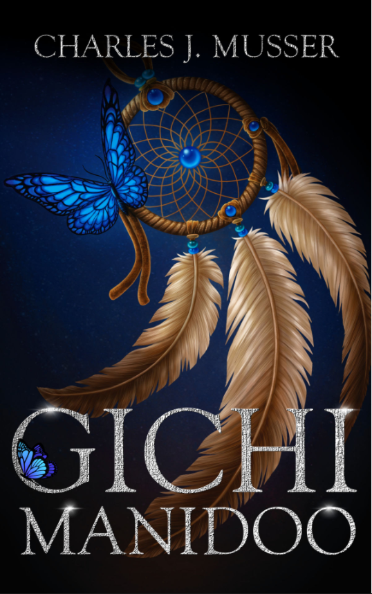

--- 
title: "Words but in Different Permutations"
author: "by Michael Yi"
site: bookdown::bookdown_site
favicon: "racoonicon.png"

---

# About {.unnumbered #about}
___

#### Greetings, I'm Michael and welcome to my portfolio. I do writing, editing and teaching but I sometimes also do less important activities such as eating and breathing.  {-}

#### Introduction {-}

|  |  |
|---|---|
| | Writing is in a strange place. It is an art is simultaneously overvalued and undervalued by the same people. Maybe it is due to the difficulty in separating the art of writing from the ability to write. Being able to write does not make one a writer anymore than someone capable of putting colour on a canvas is a painter, where the line is set is up to individual interpretation, yet, for many, the line is more muddled when it comes to words. For me, it is simple, all developments in writing, like any other art form, is about liberating the means of which we express ourselves. |

Prior to the invention of writing, the spoken word was limited to what can be remembered, which gave emphasis to rhyme and metre. While those are valuable devices, physical records of words allowed expression to be possible without them as well. Paper allowed more detailed records to be kept, the printing press allowed ideas to be spread more easily and the book gave us an organised and linear way to express ideas similar to vanishing lines and perspective points in drawing composition. 

If you have taken the time to check out the sidebar (thank you) you might have noticed I focus mostly on fiction, essays and games. This is due to my perspective on the relationship between the author and the reader, it is where I find the beauty in exploring the means of expression. A proper work of fiction  allows the reader to suspend disbelief and view the story from a new perspective, a merge of their biases and your premise without being limited by what has and has not happened. A well-researched essay combines analysis on a topic through evidence with analysis on the biases presented by the evidence themselves, creating a work through which the writer explores different perspectives together with the reader. An interactive work gives the player a way to directly interact with your story as a character in it instead of just an audience member, creating a level of intimacy between the writer and reader scarcely found prior to recent media technologies. 

I am also exploring newer forms of writing through mediums and platforms such as Twine, Tales, Story Maps and R Bookdown, which is what I built this website in. As culture and technology develops, there will no doubt be more ways to express ourselves through words in different permutations and I hope I will be able to keep up. However, it would be narrow-minded to think this would make the job of a writer more difficult or less rewarding. Everyone has stories to tell and all stories have value; how the value is realised comes down to figuring out what the best mode of expression is, and progress in terms of mediums only gives us more options. 

A good writer, like any good artist of any other art form, should be able to both speak and hear with their art. With this in mind, I sometimes wonder whether finding what to say and figuring out how to say it is a desire or a responsibility.

 

___

# Games {.unnumbered #games}

## Ascent {-}
#### First Person Platformer {-}
as Narrative Designer

[Download the game for free](https://threeraccoonsgames.itch.io/ascent)

## Code: Blue {-}
#### First Person Survival Horror {-}
as Narrative Designer

[Download the game for free](https://threeraccoonsgames.itch.io/code-blue)

## Timekeeper {-}
#### 2D Atmospheric Platformer {-}
as Co-Director and Narrative Designer

[Play the game in your browser](https://threeraccoonsgames.itch.io/timekeeper)

## Sealing of The First GOd {-}
#### Isometric Bullet Hell {-}
as Narrative Designer

[Download the game for free](https://threeraccoonsgames.itch.io/sealing-of-the-first-god)

## Back Again {-}
#### Isometric Retro Puzzle Game {-}
as Narrative Designer

[Play the game in your browser](https://zombonline.itch.io/back-again)

## Tainted Paths {-}
#### Total Overhaul for Mount and Blade: Warband {-}
as Narrative Designer and Secondary Editor

[Download the mod](https://www.moddb.com/mods/tainted-paths) 

*base game required*

## Mortal Will {-}
#### Isometric tRPG {-}
as Narrative Designer 

coming soon

story demo and gameplay demo both available, please [contact me][Contact]

___

# Interactive Fiction {.unnumbered #interactive-fiction}

## Godzilla Wednesday {-}
#### On KnightLab StoryMap JS {-}
Solo Project

<iframe src="https://uploads.knightlab.com/storymapjs/13b9e5e6d6fa2a54574b193790367066/godzilla-tuesday/index.html" frameborder="0" width="100%" height="800"></iframe>

[Click HERE to view the storymap on the original website](https://uploads.knightlab.com/storymapjs/13b9e5e6d6fa2a54574b193790367066/godzilla-tuesday/index.html)

## Zoltan Gets Out of Unemployment {-}
#### On TextureWriter {-}
Solo Project 

[This interactive story is only available on texturewriter.com, click HERE to view it on the original website](https://texturewriter.com/play/ThreeRaccoons/zoltan-gets-out-of-unemployment/info)

___

# Short Stories {.unnumbered #short-stories}

## Cloud Fortress {-}
##### Genres: Fantasy {-}

<embed src="Yi_cloudfortress.pdf" width="700" height="900" 
 type="application/pdf">

## POlitical Compass Test {-}
##### Genres: Comedy {-}

<embed src="Yi_politicalcompasstest.pdf" width="700" height="900" 
 type="application/pdf">
 
 ## Catgirl Apocalypse {-}
##### Genres: Comedy {-}

<embed src="Yi_catgirlapocalypse.pdf" width="700" height="900" 
 type="application/pdf">
 
 ## Neon Red {-}
##### Genres: Literary {-}

<embed src="Yi_neonred.pdf" width="700" height="900" 
 type="application/pdf">

## Nomad {-}
##### Genres: Literary {-}

<embed src="Yi_Nomad(updated).pdf" width="700" height="900" 
 type="application/pdf">
 
## Borge and Glark and the- {-}
##### Genres: Comedy {-}

<embed src="Yi_borgeandglark.pdf" width="700" height="900" 
 type="application/pdf">
 
## Spring Again {-}
##### Genres: Literary, Bildungsroman {-}

<embed src="Yi_springagain.pdf" width="700" height="900" 
 type="application/pdf">
 
## The Zoltan Stories {-} 
 
## Zoltan Gets a Job {-}
##### Genres: Comedy, Satire {-}

<embed src="Yi_ZoltanGetsaJob.pdf" width="700" height="900" 
 type="application/pdf">
 
## Zoltan Robs a Bank {-}
##### Genres: Comedy, Historical Fantasy {-}

<embed src="Yi_ZoltanRobsaBank.pdf" width="700" height="900" 
 type="application/pdf"> 
 
## King Zoltan the First, I Guess {-}
##### Genres: Comedy, Historical Fantasy {-}

<embed src="Yi_King_Zoltan.pdf" width="700" height="900" 
 type="application/pdf"> 
___

# Flash Fiction {.unnumbered #flash-fiction}

## Kelly and Friends {-}
##### Genres: Literary {-}

<embed src="Kelly_and_Friends[short].pdf" width="700" height="900" 
 type="application/pdf">
 
 ___
 

# Screenplays {.unnumbered #screenplays}

## King Zoltan the First/Last {-}
##### Genres: Fantasy {-}

<embed src="Yi_KingZoltan.pdf" width="700" height="900" 
 type="application/pdf">
  
 ___

# Essays {.unnumbered #essays}

## Consequence of Laughter {-}
##### Reflecting on the ways to Create and React to Comedy {-}
As it appears in the Comedy Lives special issue of [Biography: An Interdisciplinary Quarterly](https://uhpress.hawaii.edu/title/bio/) by The University of Hawai'i

<embed src="comedy_autoethnography.pdf" width="700" height="900" 
 type="application/pdf">
 
## The Sick Men of Perpetuity {-}
##### On Solidarity and Unity in a Society Built on Racial Hierarchies {-}
As it appears in the [AAHAlliance Official Website](https://www.aahalliance.com/news-2/the-sick-men-of-perpetuity)

<embed src="The_Sick_Men_of_Perpetuity.pdf" width="700" height="900" 
 type="application/pdf">
  
 
## Contradictions in Class-Based Restrictions {-}
##### on A Woman’s Labour by M. Collier, Man the Monarch by M. Leapor, A Bold Stroke for a Wife by S. Centlivre {-}

<embed src="contradictions_in_Class_Based_Restrictions.pdf" width="700" height="900" 
 type="application/pdf">
 
  
## From Ragin and Gromov to Tsars and Serfs {-}
##### on Ward no.6 by Anton Chekhov {-}

<embed src="From_Ragin_and_Gromov_to_Tsars_and_Serfs.pdf" width="700" height="900" 
 type="application/pdf">
 
  
## How Entanglements Affect Power Balance and Who Benefits {-}
##### on Blood Music by Greg Bear, Lilith's Brood by Octavia Butler and I, Robot by Isaac Asimov {-}

<embed src="How_Entanglements_affect_the_Power_Balance_and_Who_Benefits.pdf" width="700" height="900" 
 type="application/pdf">
  
## How Magic And Knowledge Make Up What And How Servitude Is {-}
##### on The Tempest by Shakespeare and Doctor Faustus by Marlowe {-}

<embed src="How_Magic_And_Knowledge_Make_Up_What_And_How_Servitude_Is.pdf" width="700" height="900" 
 type="application/pdf">

## Implied Fact and Opinion {-}
##### on Gooseberries by Anton Chekhov {-}

<embed src="Implied_Fact_and_Opinion_in_Gooseberries.pdf" width="700" height="900" 
 type="application/pdf">
 
## Interpreting Chekhov’s Intent Through His Writing Style {-}
##### on Gooseberries by Anton Chekhov {-}

<embed src="Interpreting_Chekhovs_Intent_Through_His_Writing_Style.pdf" width="700" height="900" 
 type="application/pdf">

## Marriage as a Collection of Obstacles Preventing a Functional Relationship {-}
##### on Who's The Dupe by Hannah Cowley and Nature and Art by Elizabeth Inchbald {-}

<embed src="Collection_of_Obstacles_Preventing_a_Functional_Relationship.pdf" width="700" height="900" 
 type="application/pdf">

## A Servant Understanding of Reality {-}
##### on The Cherry Orchard by Anton Chekhov and The Death of Ivan Ilyich by Leo Tolstoy {-}

<embed src="Servants_Understanding_of_Reality.pdf" width="700" height="900" 
 type="application/pdf">
 
## Solving Truth and History with Numbers and Violence {-}
##### on 1984 by George Orwell, Watchmen by Alan Moore&Dave Gibbons and Lathe of Heaven by Ursula K. Le Guin {-}

<embed src="Truth_and_History_with_Numbers_and_Violence.pdf" width="700" height="900" 
 type="application/pdf">

## The Two Ways a Society Can Change and How People React {-}
##### on Watchmen by Alan Moore & Dave Gibbons and Brave New World by Aldous Huxley {-}

<embed src="The_Two_Ways_a_Society_Can_Change_and_How_People_React.pdf" width="700" height="900" 
 type="application/pdf">

___

# Editing {.unnumbered #editing}
## Welcome Back {-}
#### Though the Three Raccoons Editing website is no longer up, I am still available for editing and translating projects in both prose and poetry. {-}
#### Pricing depends on genre, deadline and number of revisions.  {-}
#### Please contact me at [threeraccoonsbusiness@gmail.com](mailto:threeraccoonsbusiness@gmail.com) with your projects {-}

 

## Past Editing Works {-}

## Beacon Bees and The Songbirds {-}
#### An Illustrated Poetry Collection by Shamiso Zvandasara {-}

[amazon link](https://www.amazon.com/Beacon-Bees-Songbirds-Concrete-Illustrated/dp/1793053650)

## Gichi Manidoo {-}
#### A Novel by Charles J. Musser {-}

[amazon link](https://www.amazon.com/Gichi-Manidoo-Charles-J-Musser/dp/057849695X)

## Fire Molten and Ash {-}
#### A Poetry Collection by Clarence Barbee {-}

[amazon link](https://www.amazon.com/Fire-Molten-Ash-Clarence-Barbee-ebook/dp/B082KQPNVK#customerReviews)

___

# Contact {.unnumbered #contact}

Email me at: [threeraccoonsbusiness@gmail.com](mailto:threeraccoonsbusiness@gmail.com)

Call me at: <a href="tel:778-990-9780">778-990-9780</a>

___

You can also:

<a class="badge-base__link LI-simple-link" href="https://ca.linkedin.com/in/michael-yi-47514b206?trk=profile-badge">Find me on Linkedin</a>

___
              